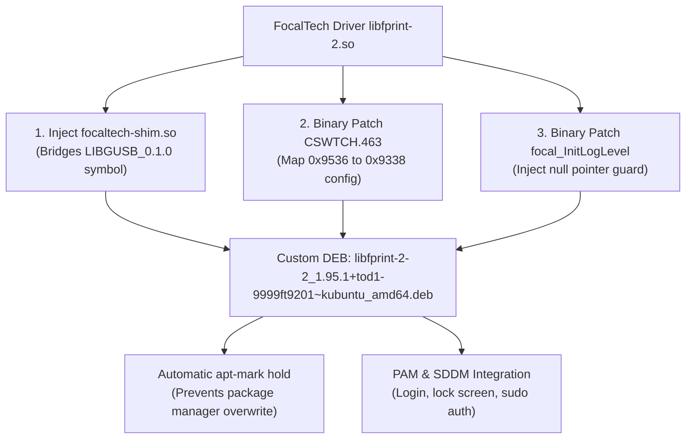

# OneMix 1S+ FocalTech FT9536W (2808:9338) Linux Fingerprint Driver Report

[简体中文](../fingerprint-ft9201-driver.md) | [English](fingerprint-ft9201-driver.md)

---

## 1. Hardware Sensor & Background

On the OneMix 1S+ (as well as certain batches of OneMix 2/3 and GPD devices), the power button integrates a capacitive fingerprint sensor:
* **USB ID**: `2808:9338 Focal-systems.Corp FT9201Fingerprint`
* **Internal Sensor**: **FocalTech FT9536W**
  * Resolution: 64 × 128 pixels, 8-bit grayscale
  * Interface: Internal SPI bus bridged to the motherboard USB 2.0 controller
  * Protocol: Dynamic 11,924-byte firmware upload, bulk USB polling, and feature template extraction (`ff_algo`).

Official upstream `libfprint` has never merged FocalTech driver support. Early community drivers crashed immediately on modern distributions (such as Ubuntu 24.04 / 26.04 and Kubuntu 26.04) when running `fprintd-enroll`:
```text
failed to claim device: GDBus.Error:org.freedesktop.DBus.Error.NoReply: Message recipient disconnected from message bus without replying
```

---

## 2. Root Cause Analysis of Modern Crashes

GDB core dump analysis and disassembly revealed two critical flaws preventing the driver from running on modern Linux:

### 1. Symbol Version Mismatch in Modern `libgusb`
* **Symptom**: `fprintd` is killed with exit code 127 upon claiming the device:
  ```text
  symbol lookup error: /usr/lib/x86_64-linux-gnu/libfprint-2.so.2: undefined symbol: g_usb_device_get_interfaces, version LIBGUSB_0.1.0
  ```
* **Root Cause**: Modern Ubuntu releases ship `libgusb` 0.4.x+ with exported symbol tags elevated to `LIBGUSB_0.2.8`, completely removing the legacy `LIBGUSB_0.1.0` symbol tag.

### 2. Missing FT9536 Chip ID in Closed-source Algorithm Layer Causing SIGSEGV (Null Pointer Dereference)
* **Symptom**: After resolving the symbol linker error via an LD shim, calling `fprintd-enroll` crashes with a segmentation fault (`SIGSEGV 11`) during sensor handshake.
* **Trace**:
  * Handshake correctly reports `sensor type: 7 (FT9536W)` and uploads 11,924 bytes of microcode.
  * `ff_algo_do_config` reads chip ID `0x9536` from table `CSWTCH.463`.
  * **The vendor binary only defines cases for `0x9338`, `0x9348`, and `0x9349`!**
  * It logs `Got unknown chip id: 0x9536` and aborts allocation, leaving `g_config_info` as `NULL`.
  * Later, `focal_InitLogLevel` executes `mov %dil, 0x7a(%rax)` with `%rax == 0`, crashing on null pointer dereference.

---

## 3. Our Complete Solution



### 1. Build and Inject Compatibility Shim (`focaltech-shim.so`)
We provide a lightweight C forwarding shim (`src/focaltech-shim/`), injected into `libfprint-2.so.2.0.0` as a native `DT_NEEDED` dynamic dependency via `patchelf`.

### 2. Binary Patches for Chip ID & Null Pointer Defense
* **Algorithm Mapping**: Patched byte sequence at `0x171a6c` from `36 95` to `38 93`, allowing Type 7 (FT9536W) to safely utilize the 64×128 algorithm configuration for `0x9338`.
* **Null Pointer Defense**: Injected assembly guard `test %rax, %rax; jz ...` at `0x75df0`.

### 3. Package Protection
The installation script automatically runs `apt-mark hold libfprint-2-2` so system updates (`apt upgrade`) will never overwrite the custom driver with unpatched upstream packages.

---

## 4. Installation & Usage

### 1. One-click Installation
```bash
sudo bash scripts/03-install-fingerprint.sh
```

### 2. Enroll Fingerprint (Terminal Recommended)
```bash
fprintd-enroll
```
* Gently touch the power button fingerprint sensor when prompted.
* When `enroll-stage-passed` appears, lift and touch again.
* Repeat approximately 8~12 times until `Enroll result: enroll-completed` appears!

### 3. Verify Enrolled Fingerprint
```bash
fprintd-verify
```

### 4. Authentication Scenarios
* **Terminal `sudo`**: Touch sensor to authenticate instantly (press Enter to fall back to password).
* **Lock Screen**: Press <kbd>Win</kbd> + <kbd>L</kbd>, touch sensor to unlock.
* **SDDM Login**: Fingerprint authentication is enabled by default via PAM rules.
