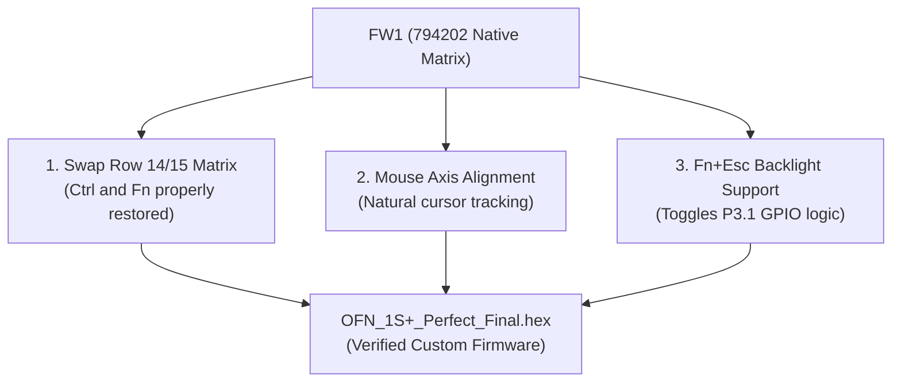

# OneMix 1S+ Keyboard & OFN Optical Mouse Firmware Analysis & Fix

[简体中文](../keyboard-and-ofn-firmware.md) | [English](keyboard-and-ofn-firmware.md)

---

## 1. Controller & Sensor Architecture

The keyboard and optical finger navigation (OFN) pointing device are managed by an onboard microcontroller:
* **Keyboard MCU**: **Sinowealth SH68F83**
  * Architecture: Enhanced 8051 core (pipelined instruction set, 1 cycle per machine cycle)
  * Memory: Integrated 16KB Flash ROM with hardware full-speed USB 2.0 controller
  * USB ID: `258a:0021 HAILUCK CO.,LTD USB KEYBOARD`
* **Pointing Sensor**: **Hynitron OFN Optical Sensor**
  * Interface: I2C slave mode (Address `0x33`) connected to the SH68F83 MCU
  * Function: Captures micro-surface displacement and reports standard USB HID mouse coordinates.
* **Physical Matrix**: 17 Rows × 8 Columns key scanning network.

---

## 2. Official Firmware Defects & Root Cause Analysis

Two primary official firmware builds were released across the 1S and 2nd-gen product lines:
1. **1st-Gen 1S Firmware**: `OFN_5813576462_Hynitron_20180321_794202_WIN10_US_del_bs.hex` (**FW1**)
2. **2nd-Gen Firmware**: `OFN_5813576462_Hynitron_20180321_794210_WIN10_US_del_bs_fn_wheel_new_pcb_v06.hex` (**FW2**)

### 1. Why FW1 swaps Fn and Ctrl on the 1S+
* Firmware disassembly reveals:
  * In the FW1 key matrix table, `Row 14 Col 2` is assigned to `Fn`, while `Row 15 Col 1` is assigned to `Left Ctrl`.
  * However, on the physical 1S+ chassis, the bottom-left keycap is labeled `Ctrl`, and the adjacent key is labeled `Fn`.
  * Flashing FW1 causes pressing the key labeled `Ctrl` to emit `Fn`, and pressing `Fn` to emit `Ctrl`.

### 2. Why FW2 scrambles keys and rotates mouse 90 degrees
* The 2nd-generation chassis (OneMix 2 / 2S) redesigned the keyboard PCB trace layout:
  * FW2 shifts the entire top row: `Tab` emits `1`, `1` emits `2`, `~` emits `Tab`, `0` emits `Backspace`, etc.
  * **However, the physical flex cable and matrix in the 1S+ follow the 1st-generation routing!** Flashing FW2 breaks nearly all key mappings.
* Furthermore, FW2 transposes the OFN optical sensor's X and Y axis registers, causing mouse navigation to rotate 90 degrees clockwise (swiping left moves the cursor down, swiping right moves it up).

---

## 3. The Verified Firmware Solution (`OFN_1S+_Perfect_Final.hex`)

Our custom firmware `firmware/OFN_1S+_Perfect_Final.hex` is based on the **FW1 native matrix**, modified via disassembly and targeted hex injection:



1. **Restored Keycaps**:
   * Swapped `Row 14 Col 2` and `Row 15 Col 1`. The physical `Ctrl` key sends `Left Ctrl`, and `Fn` sends `Fn`.
   * Preserved 100% accurate top-row mapping: `Tab`, `1`~`0`, `~`, `Backspace`, `Delete` match physical legends.
2. **Natural Mouse Tracking**:
   * Fixed coordinate mapping: swiping left moves cursor left, swiping right moves cursor right.
3. **Hardware Backlight & Shortcuts**:
   * Preserves `Fn + Esc` toggle to flip MCU pin P3.1 for keyboard backlighting.

---

## 4. Firmware Flashing Steps (Windows)

> [!NOTE]
> The flasher tool is a Windows-native x86 executable utilizing Sinowealth's USB ISP protocol. Flashing once writes the firmware directly into the MCU's internal 16KB Flash ROM. It persists across reboots, OS reinstalls, and works identically under both Windows and Linux!

1. Boot into Windows and open the `firmware/` folder in this repository.
2. Run the flasher tool:
   ```text
   Hailuck_KeyBoard_Update_Tool_for_68F83.exe
   ```
3. The tool scans for HEX files in the same directory. In the dropdown list, select:
   ```text
   OFN_1S+_Perfect_Final.hex
   ```
4. Click **start** to begin flashing.
5. Once the progress bar finishes and displays green **PASS**, flashing is complete!
6. Test keys and optical mouse immediately.
