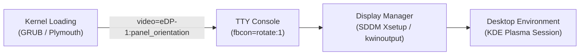
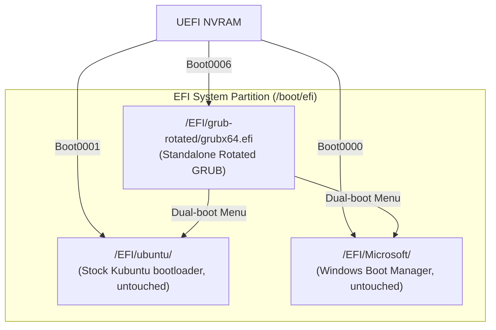

# OneMix 1S+ End-to-End Screen Rotation & Hardware-Rotated GRUB Guide

[简体中文](../screen-and-rotation.md) | [English](screen-and-rotation.md)

---

## 1. Physical Characteristics & The Core Challenge

Ultra-mobile PCs (UMPCs) like the One-Netbook OneMix series use compact, high-density LCD panels originally manufactured for tablets or mobile devices:

* **Physical Orientation**: **Portrait (竖屏)**, physical resolution 1200 × 1920.
* **Internal Interface**: **`eDP-1`** (Intel Gen9 Embedded DisplayPort).
* **Resulting Issues**:
  1. From system power-on through GRUB boot menu, kernel initialization, Plymouth splash screen, and TTY console, rendering defaults to portrait (sideways).
  2. The SDDM display manager login screen is rotated 90 degrees, making password entry frustrating.
  3. Mainline GNU GRUB does not support GOP framebuffer rotation via config flags.

---

## 2. Mandatory Prerequisite (Desktop GUI Configuration)

> [!IMPORTANT]
> **Before running automation scripts or writing bootloader configurations, the user MUST configure display orientation once inside the desktop graphical environment!**

### Step-by-Step Instructions:
1. Open the application launcher and open **System Settings**.
2. Select **Display and Monitor** on the left.
3. In the **Orientation** dropdown, select the 4th option: **Counterclockwise 90° (逆时针转 90°)**.
4. Click **Apply** at the bottom right. The desktop should now be correctly oriented in landscape mode.

### Why is this prerequisite strictly mandatory?
* Modern Linux display managers (such as SDDM under KDE Plasma 6 Wayland) rely on synthesizer output configuration files rather than legacy X11 `xrandr` commands.
* Clicking "Apply" generates the valid output descriptor in your user space:
  ```text
  ~/.config/kwinoutputconfig.json
  ```
* The script `scripts/01-setup-screen-rotation.sh` reads this verified JSON file and synchronizes it to the SDDM system daemon (`/var/lib/sddm/.config/kwinoutputconfig.json`). Skipping this step prevents SDDM from acquiring the proper landscape mapping.

---

## 3. End-to-End Landscape Architecture



### 1. Kernel Command Line & Plymouth Boot Splash
In `/etc/default/grub`, append to `GRUB_CMDLINE_LINUX_DEFAULT`:
```bash
GRUB_CMDLINE_LINUX_DEFAULT="quiet splash video=eDP-1:panel_orientation=right_side_up fbcon=rotate:1"
```
* **`video=eDP-1:panel_orientation=right_side_up`**: Informs the DRM driver of the panel's physical mounting angle, rotating Plymouth boot animations into landscape from the first second of boot.
* **`fbcon=rotate:1`**: Rotates the virtual framebuffer console 90 degrees clockwise to match landscape orientation.

Apply changes:
```bash
sudo update-grub
sudo update-initramfs -u
```

### 2. SDDM Login Screen (X11 Session)
In `/usr/share/sddm/scripts/Xsetup`, append:
```bash
xrandr --output eDP-1 --rotate right
```

### 3. SDDM Login Screen (Wayland Session)
Copy the user's calibrated Plasma configuration to SDDM:
```bash
sudo mkdir -p /var/lib/sddm/.config
sudo cp ~/.config/kwinoutputconfig.json /var/lib/sddm/.config/
sudo chown -R sddm:sddm /var/lib/sddm/.config/
```

---

## 4. Hardware-Rotated GRUB Bootloader (Kyle Bader Patch & Standalone EFI)

### 1. Why standard GRUB cannot rotate on portrait panels
Users often try adding options to `/etc/default/grub`:
```bash
GRUB_GFXMODE=1280x800,1920x1200,auto
#GRUB_GFXROTATION=1
```
However, on the OneMix 1S+, this is **completely ignored**.  
* **Root Cause**: The motherboard's UEFI GOP (Graphics Output Protocol) firmware strictly reports a **1200 × 1920 portrait framebuffer**.
* GNU GRUB's official `video_fb` driver only performs linear row-by-row memory blitting, lacking 90°/270° coordinate translation algorithms in source code.
* Hiding the menu with `GRUB_TIMEOUT=0` avoids the sideways menu but breaks dual-boot convenience with Windows.

### 2. 2D Framebuffer Rotation Patch Architecture
This repository incorporates the proven **Kyle Bader GRUB 2D Framebuffer Rotation Patch**:
* Patch Source: `packages/bootloader/0001-grub-framebuffer-rotation.patch`
* Patches `grub-core/video/fb/` (`fbblit.c`, `fbfill.c`, `fbutil.c`, `video_fb.c`):
  * Swaps logical width and height during render target allocation ($1200 \times 1920 \to 1920 \times 1200$ logical viewport);
  * Dynamically translates 2D logical coordinates `(x, y)` to physical portrait VRAM addresses during pixel writes:
    $$\begin{cases} x_{\text{phys}} = y \\ y_{\text{phys}} = \text{width} - 1 - x \end{cases} \quad (270^\circ \text{ clockwise rotation})$$
  * When `set rotation=270` is executed in `grub.cfg`, the boot menu renders in clean **1920 × 1200 landscape**.

### 3. Zero-Risk Standalone EFI Architecture



* **Standalone Pre-compiled EFI (`packages/bootloader/grubx64_rotated.efi`)**:
  * Bundles 295 core modules internally (`all_video`, `efi_gop`, `video_fb`, `gfxterm`, `ext2`, `fat`, `part_gpt`, `search`, `linux`, `chain`), eliminating external `.mod` dependencies and ABI conflicts;
  * Automatically discovers the root partition UUID and executes `/boot/grub/grub.cfg`, preserving dual-boot options for Ubuntu and Windows.
* **Non-destructive UEFI NVRAM Entry**:
  * Installed to `/EFI/grub-rotated/grubx64.efi` as `Boot0006`;
  * Stock Kubuntu (`Boot0001`) and Windows Boot Manager (`Boot0000`) remain untouched as permanent fallbacks;
  * Supports UEFI one-shot testing via `sudo efibootmgr -n 0006` before permanent activation.

---

## 5. Automated Installation & Verification

Once you have completed the GUI rotation prerequisite in Section 2, run:
```bash
sudo bash scripts/01-setup-screen-rotation.sh
```
The script backs up configs, injects kernel arguments, updates initramfs, syncs SDDM, and optionally installs the rotated GRUB bootloader.

To install or manage rotated GRUB standalone:
```bash
# Install rotated EFI and configure rotation
sudo bash packages/bootloader/install-rotated-grub.sh

# Single safe test reboot (only affects the next reboot)
sudo efibootmgr -n 0006 && sudo reboot

# Once verified, set permanently as the primary boot entry:
sudo efibootmgr -o 0006,0001,0000,0002

# Verify current boot order:
efibootmgr | grep "^BootOrder"
# Output: BootOrder: 0006,0001,0000,0002
```

> [!NOTE]
> **Real-hardware Verified**:
> This setup has been fully verified on physical OneMix 1S+ (m3-8100Y) hardware:
> 1. GRUB boot menu renders in 1920×1200 landscape with a 5-second timeout;
> 2. Arrow keys switch smoothly between Kubuntu and Windows Boot Manager;
> 3. Plymouth, SDDM, and KDE desktop display seamlessly in landscape mode.
