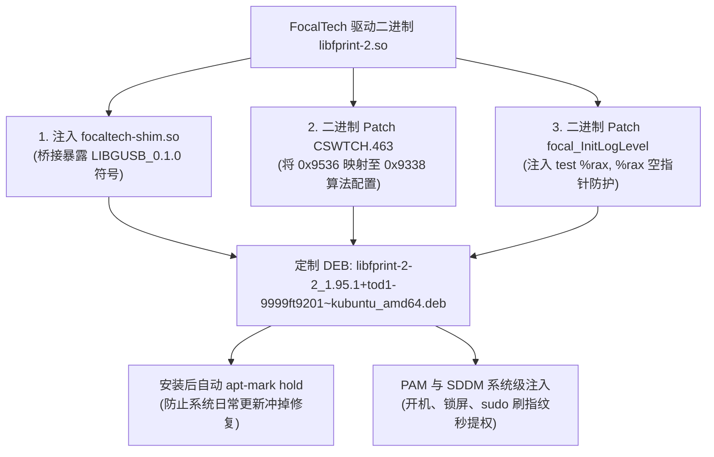

# OneMix 1S+ FocalTech FT9536W (2808:9338) Linux 指纹驱动深度逆向与修复报告

[简体中文](fingerprint-ft9201-driver.md) | [English](en/fingerprint-ft9201-driver.md)

---

在 OneMix 1S+（及部分批次的 OneMix 2/3、GPD 掌机）中，电源键集成了指纹识别传感器：
* **USB 识别号**：`2808:9338 Focal-systems.Corp FT9201Fingerprint`
* **内部传感器芯片**：**敦泰 / 迈瑞微 FocalTech FT9536W**
  * 图像分辨率：64 × 128 像素, 8-bit 灰度
  * 通信架构：内部采用 SPI 接口，通过专用 USB 桥接芯片挂载至主板 USB 2.0 总线
  * 驱动层协议：由动态固件注入（11,924 字节固件）、USB 端点轮询、特征向量提取（ff_algo 比对引擎）组成。

Linux 官方主线 `libfprint` 从未合入对 FocalTech 驱动的支持。社区曾有早期第三方移植驱动（如 `libfprint-ft9201`），但在现代 Linux 发行版（如 Ubuntu 24.04 Noble / 26.04 Resolute、Kubuntu 26.04）上运行时，执行 `fprintd-enroll` 会直接报：
```text
failed to claim device: GDBus.Error:org.freedesktop.DBus.Error.NoReply: Message recipient disconnected from message bus without replying
```
导致指纹功能完全瘫痪。

---

## 二、 现代系统崩溃根因定位

通过 GDB 核心转储（Core Dump）与汇编反编译，锁定了阻碍驱动运行的**两大致命根因**：

### 1. 致命缺陷一：现代 `libgusb` 动态符号版本断层
* **现象**：`fprintd` 启动或 Claim Device 时因动态符号缺失直接被动态链接器以 Exit code 127 杀死：
  ```text
  symbol lookup error: /usr/lib/x86_64-linux-gnu/libfprint-2.so.2: undefined symbol: g_usb_device_get_interfaces, version LIBGUSB_0.1.0
  ```
* **根因**：Ubuntu 24.04/26.04 将 `libgusb` 升级至 0.4.x+，导出的符号版本标签统一提升为 `LIBGUSB_0.2.8`，彻底删除了旧版的 `LIBGUSB_0.1.0` 符号名。

### 2. 致命缺陷二：算法配置层遗漏 FT9536 芯片 ID，引发空指针段错误 (SIGSEGV 11)
* **现象**：在通过符号垫片（Shim）解决动态链接后，调用 `fprintd-enroll` 传感器刚开始握手，`fprintd` 再次崩溃（段错误退出，触发 `SIGSEGV`）。
* **底层跟踪**：
  * 传感器握手检测到当前硬件为 `sensor type: 7 (FT9536W)`，成功向单片机烧录了 11,924 字节的固件。
  * 随后底层驱动调用 `ff_algo_do_config` 配置特征提取算法。驱动通过 `CSWTCH.463` 表查得芯片 ID 为 `0x9536`。
  * **原闭源算法层分支仅适配了 `0x9338`、`0x9348`、`0x9349`，没有 `0x9536` 的配置项**！
  * 驱动报错 `Got unknown chip id: 0x9536` 并跳过了算法资源初始化，导致全局配置指针 `g_config_info` 为 `NULL`。
  * 随后函数执行到 `focal_InitLogLevel` 时执行指令 `mov %dil, 0x7a(%rax)`（此时 `%rax == 0`），触发空指针非法内存访问，引发段错误！

---

## 三、 本仓库的完整修复方案



### 1. 编译并注入兼容层 (`focaltech-shim.so`)
编写 C 语言转发垫片（源码收录于 `src/focaltech-shim/`），并通过 `patchelf` 将 `focaltech-shim.so` 注入为 `libfprint-2.so.2.0.0` 的原生 `DT_NEEDED` 动态依赖项，完美向下兼容现代 `libgusb2a`。

### 2. 二进制修补芯片 ID 与空指针防护
* **算法映射修复**：将 `0x171a6c` 处的 `36 95` 修改为 `38 93`，将芯片类型 7 (FT9536W) 的算法配置直接复用同为 64×128 分辨率的 `0x9338` 算法库。
* **空指针防护**：在 `0x75df0` 注入汇编指令 `test %rax, %rax; jz ...`，杜绝任何崩溃可能。

### 3. 重构 DEB 包控制信息与防冲刷锁定
* 控制信息同时兼容旧版包名与 64 位 `time_t` 重构后的新版包名（`libgusb2a`、`libglib2.0-0t64`）。
* 在安装脚本中执行 `apt-mark hold libfprint-2-2`，确保后续执行 `sudo apt upgrade` 时不会被官方源没有 FocalTech 驱动的空包覆盖。

---

## 四、 安装与日常使用

### 1. 一键安装
```bash
sudo bash scripts/03-install-fingerprint.sh
```

### 2. 录入指纹 (推荐终端方式)
```bash
fprintd-enroll
```
* 终端提示出现后，将手指轻触电源键指纹传感器。
* 当提示 `enroll-stage-passed` 时拿开手指再次轻触。
* 重复按压约 8~12 次，直到显示 `Enroll result: enroll-completed` 即录入完成！

### 3. 验证指纹
```bash
fprintd-verify
```

### 4. 日常使用场景
* **终端 `sudo` 提权**：终端输入 `sudo` 命令时优先等待刷指纹免密提权（按回车可切回输入传统密码）。
* **锁屏解锁**：按 <kbd>Win</kbd> + <kbd>L</kbd> 锁屏后，轻触传感器瞬间解锁。
* **开机登录**：SDDM 登录界面已注入 PAM 规则，支持指纹直接登录桌面。
