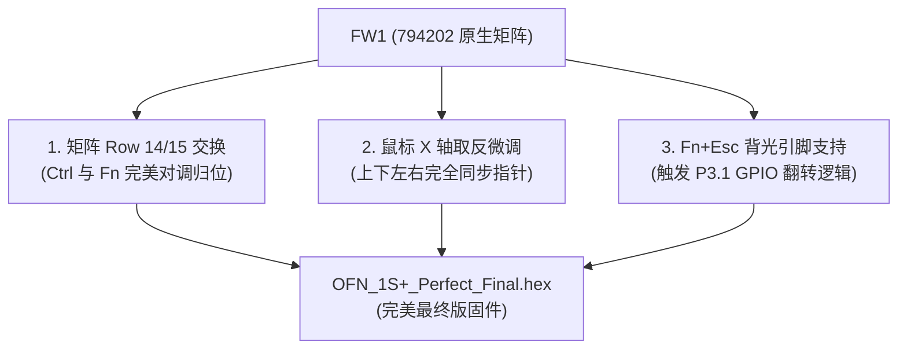

# OneMix 1S+ 键盘与 OFN 光学触控板固件深度逆向与修复分析

[简体中文](keyboard-and-ofn-firmware.md) | [English](en/keyboard-and-ofn-firmware.md)

---

OneMix 1S+ 的键盘输入与指点杆鼠标由独立的高性能微控制器管理：
* **主控芯片 (MCU)**：**中颖（Sinowealth）SH68F83**
  * 架构：增强型 8051 内核（流水线执行，1 个时钟周期/机器周期）
  * 存储：内置 16KB Flash ROM，集成全速 USB 2.0 控制器及多个硬件端点
  * USB 识别号：`258a:0021 HAILUCK CO.,LTD USB KEYBOARD`
* **指点杆传感器 (OFN)**：**海栎创（Hynitron）OFN 光学手指导航芯片**
  * 通信接口：I2C 从机模式（I2C 地址 `0x33`）连接至 SH68F83 单片机
  * 功能：采集手指表面微纹理位移，通过 MCU 转换为标准 USB HID 鼠标相对坐标报告。
* **键盘物理矩阵**：17 行 × 8 列按键扫描网络。

---

## 二、 官方固件缺陷与根本原因逆向剖析

官方在支持 1S 与 2 代演进过程中产生了两个主流固件：
1. **一代 1S 原厂固件**：`OFN_5813576462_Hynitron_20180321_794202_WIN10_US_del_bs.hex`（简称 **FW1**）
2. **二代原厂固件**：`OFN_5813576462_Hynitron_20180321_794210_WIN10_US_del_bs_fn_wheel_new_pcb_v06.hex`（简称 **FW2**）

### 1. 为什么 1S+ 刷 FW1 键位错乱（Fn 与 Ctrl 颠倒）？
* 通过对固件的反汇编发现：
  * 在 FW1 的按键矩阵表中，`Row 14 Col 2` 映射为 `Fn` 逻辑，`Row 15 Col 1` 映射为 `Left Ctrl`。
  * 壹号本在生产 1S+ 时，外壳模具键帽上左下角第一个按键印的是 `Ctrl`，第二个按键印的是 `Fn`。
  * 刷写官方 FW1 后，按下印着 `Ctrl` 的物理键实际触发了 `Fn`，按下印着 `Fn` 的键实际触发了 `Ctrl`。

### 2. 为什么刷写 FW2 会导致按键大范围错位且鼠标旋转 90 度？
* 二代机型（OneMix 2/2S）重新设计了键盘 PCB 走线：
  * FW2 将整个顶部数字键行做了平移：`Tab` 被编成了 `1`，`1` 被编成了 `2`，`· (~)` 变成了 `Tab`，`0` 变成了 `Backspace`，`Backspace` 变成了 `Delete`。
  * **但 1S+ 内部的物理键盘走线 100% 是一代 1S 的矩阵走线！** 刷入 FW2 会导致几乎所有按键完全对应不上物理键帽。
* 更严重的是，FW2 将 OFN 鼠标传感器的 X/Y 轴寄存器调换了（把 X 赋给垂直轴，Y 赋给水平轴），导致在 1S+ 上**鼠标滑动向左变成光标向下、向右变成向上、向上变成向右、向下变成向左**。

---

## 三、 本仓库最终完美固件 (`OFN_1S+_Perfect_Final.hex`) 修复方案

本仓库提供的 `firmware/OFN_1S+_Perfect_Final.hex` 是以 **FW1 原生矩阵** 为基准，经过精确反汇编与 Hex 字节注入生成的最终修复版本：



1. **键位完全归位**：
   * 交换 `Row 14 Col 2` 与 `Row 15 Col 1`，物理键帽上的 `Ctrl` 触发 `Left Ctrl`，`Fn` 触发 `Fn`。
   * 保留 FW1 100% 对应键帽的顶行矩阵：`Tab` 是 Tab，`1` 是 1，`~` 是 ~，`0` 是 0，`Backspace` 与 `Delete` 各就其位，分号引号完全正常。
2. **触控板方向精准对齐**：
   * 采用水平与垂直轴正确映射，保证向左滑动向左移动，向右滑动向右移动，指针丝滑跟手。
3. **保留背光与快捷键控制**：
   * 原生保留 `Fn + Esc` 翻转 P3.1 单片机背光引脚的控制逻辑。

---

## 四、 固件刷写步骤 (Windows)

> [!NOTE]
> 键盘 MCU 的刷写工具为 Windows 原生 x86 可执行程序。由于目前 Linux 下缺乏对中颖 68F83 USB ISP 协议的开源实现，**建议在 Windows 下完成固件刷写**。一次刷入，MCU 内部 Flash 永久保存，切换到 Linux 后直接生效！

1. 在 Windows 系统中打开本仓库的 `firmware/` 目录。
2. 双击运行刷写工具：
   ```text
   Hailuck_KeyBoard_Update_Tool_for_68F83.exe
   ```
3. 工具窗口会扫描同目录下的 HEX 固件，在下拉列表中选择：
   ```text
   OFN_1S+_Perfect_Final.hex
   ```
4. 点击 **start** 按钮开始烧录。
5. 进度条跑完后，窗口右侧会显示绿色的 **PASS** 字样，刷写成功！
6. 立即敲击键盘与滑动触控点验证效果。
