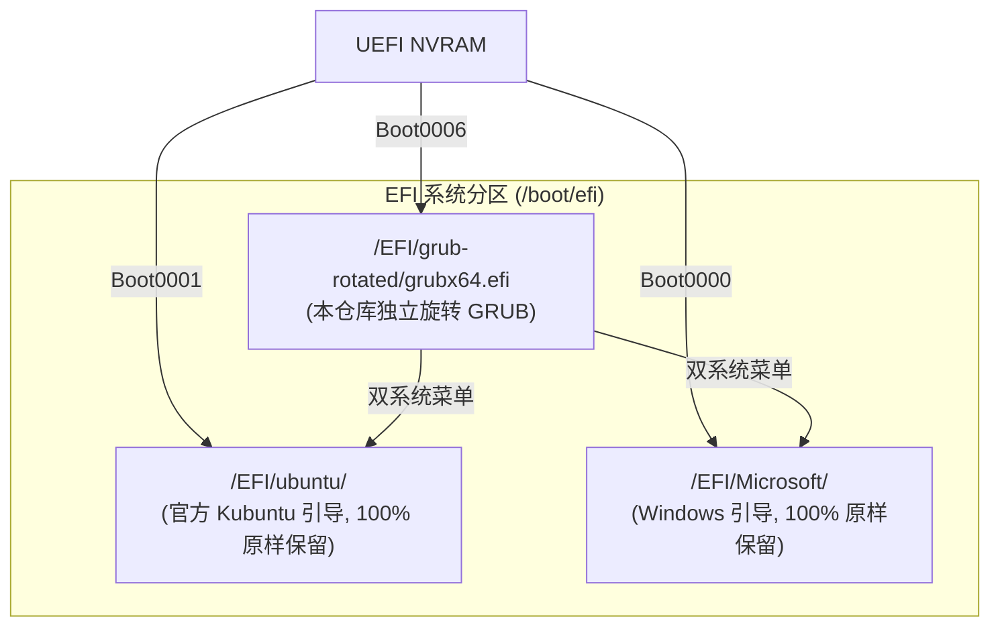

# OneMix 1S+ 屏幕旋转链路与开机全横屏配置指南

[简体中文](screen-and-rotation.md) | [English](en/screen-and-rotation.md)

---

壹号本（One-Netbook）OneMix 系列以及大部分 7~8 英寸超便携掌机（UMPC）为了兼顾机身尺寸与采购成本，普遍采用原本为高分辨率平板或智能手机设计的 LCD 面板。

* **物理原生方向**：**竖屏 (Portrait)**，物理分辨率为 1200 × 1920。
* **物理扫描通道**：**`eDP-1`**（Intel 核显内部嵌入式 DisplayPort 通道）。
* **出现的问题**：
  1. 系统开机通电到进入桌面之前（包括 GRUB 引导菜单、Linux 内核加载、Plymouth 启动动画、TTY 文本终端），默认均按照竖向渲染。
  2. 开机进入 SDDM 登录输入密码界面时，界面旋转 90 度呈竖屏，输密码极不方便。
  3. 桌面旋转若未经过规范持久化，切换 Wayland/X11 会话或新用户登录时又会打回原形。

---

## 二、 极其关键的操作前提 (Mandatory Prerequisite)

> [!IMPORTANT]
> **在运行自动化修复脚本或写入系统全局引导之前，用户必须先在桌面图形界面完成一次手动设置！**

### 手动设置步骤：
1. 打开系统桌面主菜单，点击打开 **【系统设置 (System Settings)】**。
2. 在左侧列表中选择 **【显示和监视器 (Display and Monitor)】**。
3. 找到 **【方向 (Orientation)】** 下拉菜单，在 4 个旋转选项中，**手动选择第 4 个：【逆时针旋转 90° (Counterclockwise 90°)】**。
4. 点击右下角的 **【应用 (Apply)】**，屏幕随即旋转为正常的正向横屏。

### 为什么必须先手动执行这一步？
* 在现代 Linux（特别是 KDE Plasma 6 Wayland 会话）下，Display Manager（如 SDDM）在 Wayland 模式下不读取旧时代的 X11 `xrandr` 指令，而是依赖合成器输出配置文件。
* 当你在 KDE 设置中手动选择“逆时针转90°”并点击应用时，系统会在你的家目录下生成标准输出描述文件：
  ```text
  ~/.config/kwinoutputconfig.json
  ```
* 仓库脚本 `scripts/01-setup-screen-rotation.sh` 会读取这份已经校准好的 JSON 文件，并同步拷贝至 SDDM 运行用户空间（`/var/lib/sddm/.config/kwinoutputconfig.json`）。如果跳过该步骤，SDDM 将无法获取正确的旋转映射。

---

## 三、 全链路全景横屏配置细节


### 1. 内核参数与开机动画 (GRUB & Plymouth)
编辑 `/etc/default/grub`，在 `GRUB_CMDLINE_LINUX_DEFAULT` 追加参数：
```bash
GRUB_CMDLINE_LINUX_DEFAULT="quiet splash video=eDP-1:panel_orientation=right_side_up fbcon=rotate:1"
```
* **`video=eDP-1:panel_orientation=right_side_up`**：通知 Linux DRM 显卡驱动，将 `eDP-1` 的物理安装朝向定义为右侧朝上（相当于顺时针旋转90度矫正），使 Plymouth 开机动画在内核加载的第一秒就以正向横屏渲染。
* **`fbcon=rotate:1`**：使底层 Framebuffer 文本控制台顺时针旋转90度对齐。

修改后执行同步：
```bash
sudo update-grub
sudo update-initramfs -u
```

### 2. SDDM 登录界面 (X11 会话)
在 `/usr/share/sddm/scripts/Xsetup` 末尾追加：
```bash
xrandr --output eDP-1 --rotate right
```

### 3. SDDM 登录界面 (Wayland 会话)
将用户目录下的输出配置同步到 SDDM：
```bash
sudo mkdir -p /var/lib/sddm/.config
sudo cp ~/.config/kwinoutputconfig.json /var/lib/sddm/.config/
sudo chown -R sddm:sddm /var/lib/sddm/.config/
```

---

## 四、 硬件级横屏 GRUB 引导器 (Kyle Bader 补丁与独立 EFI)

### 1. 为什么官方 GRUB 无法横屏？
很多用户在尝试配置 `/etc/default/grub` 时，会尝试加入：
```bash
GRUB_GFXMODE=1280x800,1920x1200,auto
#GRUB_GFXROTATION=1
```
然而这在 1S+ 上**完全无效**。
* **原因**：主板 UEFI GOP (Graphics Output Protocol) 驱动向 GRUB 上报的物理显示模式是固定的 **1200 × 1920 竖屏**。
* GNU GRUB 官方代码中的 `video_fb` 帧缓冲区驱动仅支持标准的逐行线性内存拷贝（Linear Blit），完全缺少 90°/270° 显存坐标变换代码。
* 过去的权宜之计只能是将 `GRUB_TIMEOUT=0` 隐藏菜单，直接跳过引导直接进内核，但这导致双系统用户无法方便切换到 Windows。

### 2. 2D Framebuffer 旋转补丁原理
本仓库引入了在 UMPC 领域（如 GPD Pocket / OneMix 系列）经受实战检验的 **Kyle Bader GRUB 2D Framebuffer Rotation 补丁**：
* 核心补丁文件：`packages/bootloader/0001-grub-framebuffer-rotation.patch`
* 补丁修改了 `grub-core/video/fb/` 下的 `fbblit.c`、`fbfill.c`、`fbutil.c` 及 `video_fb.c`：
  * 在分配 Render Target 时，将逻辑宽和高进行几何对调（1200×1920 映射为 1920×1200 逻辑视口）；
  * 在底层向显存写入像素或位图文字时，实时将二维逻辑坐标 `(x, y)` 映射变换为物理竖屏显存地址：
    $$\begin{cases} x_{\text{phys}} = y \\ y_{\text{phys}} = \text{width} - 1 - x \end{cases} \quad (\text{旋转 } 270^\circ)$$
  * 当在 GRUB 脚本中执行 `set rotation=270` 时，菜单文字、高亮框与背景均实时以完美的 **1920 × 1200 正向横屏** 渲染！

### 3. 零风险独立 EFI 架构设计
为了恪守“不破坏现有系统引导与双系统”原则，本方案采用了**完全独立外置**的引导部署机制：



* **自包含独立 EFI (`packages/bootloader/grubx64_rotated.efi`)**：
  * 预先内嵌打包了 295 个常用 GRUB 模块（含 `all_video`, `efi_gop`, `video_fb`, `gfxterm`, `ext2`, `fat`, `part_gpt`, `search`, `linux`, `chain` 等），完全不依赖外部 `.mod` 碎片，避免因发行版包升级导致 ABI 不匹配；
  * 内置开机引导脚本：自动以根目录 UUID 动态搜索并载入 `/boot/grub/grub.cfg`，同时完整识别 Linux 与 Windows 双系统。
* **独立的 NVRAM 启动项**：
  * 注册为独立的 `Boot0006`，完全不覆盖 `Boot0001` (Kubuntu) 和 `Boot0000` (Windows Boot Manager)；
  * 支持通过 UEFI 标准单次测试机制 `sudo efibootmgr -n 0006` 安全试运行。若不满意或断电，下一次开机自动退回默认引导，**绝不存在变砖或无法开机的风险**。

---

## 五、 一键自动化应用

完成上述【第二步】的手动图形界面旋转后，打开终端运行：
```bash
sudo bash scripts/01-setup-screen-rotation.sh
```
脚本会自动完成备份、检测、GRUB 内核参数修改、Initramfs 刷新、SDDM 配置注入，并可选择一键部署硬件级横屏 GRUB 引导器。随后重启系统即可拥有开机全链路横屏体验！

如需单独安装或管理横屏 GRUB 引导器：
```bash
# 单独安装并配置
sudo bash packages/bootloader/install-rotated-grub.sh

# 单次安全测试 (仅生效下一次开机)
sudo efibootmgr -n 0006 && sudo reboot

# 确认体验满意后，永久设为首选引导 (将 0006 排在最前，原引导作为兜底)：
sudo efibootmgr -o 0006,0001,0000

# 验证当前引导顺序：
efibootmgr | grep "^BootOrder"
# 输出: BootOrder: 0006,0001,0000,0002 (永久首选横屏 GRUB)
```

> [!NOTE]
> **真机实测状态 (Real-hardware Verified)**：
> 本方案已在真实 OneMix 1S+ (m3-8100Y) 设备上完成真机冷启动与热重启全流程验证：
> 1. GRUB 菜单以 1920×1200 正向横屏渲染，倒计时 5 秒正常；
> 2. 支持上下键顺畅切换 Kubuntu 与 Windows Boot Manager；
> 3. 进入系统后 Plymouth、SDDM 登录界面与 KDE 桌面全链路横屏无缝衔接。
```
